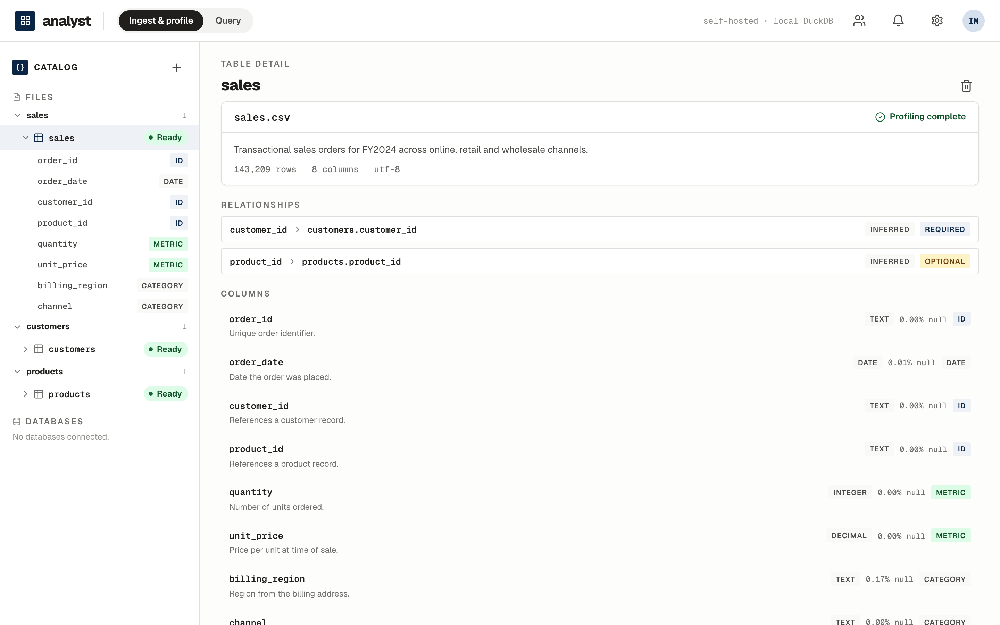

# analyst

**Self-hosted AI data analyst.** Drop in Excel/CSV files or connect a
database; an agent automatically profiles, catalogues, and *understands* your
data, so anyone on the team can ask questions in plain English — with the
profiling, relationships, generated SQL, and assumptions always one click
away.

> **Autopilot by default, grab the wheel on demand.**

📖 **[User manual (with screenshots)](https://freesidenomad.github.io/analyst/)** ·
🐳 **[`ghcr.io/freesidenomad/analyst`](https://github.com/FreeSideNomad/analyst/pkgs/container/analyst)**



## Quick start (Docker)

One self-contained image — API, DuckDB/Parquet analytical engine, and web UI
in a single container:

```bash
docker run -d --name analyst \
  -p 8000:8000 \
  -v analyst-data:/data \
  ghcr.io/freesidenomad/analyst:latest
```

Open <http://localhost:8000>. Ingestion, profiling, cataloguing, and
relationship discovery run **fully locally** with no external calls. Add
`-e ANTHROPIC_API_KEY=...` (or a Claude subscription token via
`-e CLAUDE_CODE_OAUTH_TOKEN=...`, from `claude setup-token`) plus
`-e ANALYST_CATALOG=live` to enable natural-language Q&A, dashboards,
curation, and agent-written catalog descriptions — the
governance invariant holds regardless: **raw bulk data never leaves the box**
(only schema, profiles, capped samples, and small result sets reach the
model; SQL executes locally in DuckDB).

See the [manual](https://freesidenomad.github.io/analyst/) for OAuth login,
workspaces, encrypted credential storage, backups, and the full
configuration reference.

## What it does

| | |
|---|---|
| **Agentic ingestion** | CSV/TSV/Excel/JSON → profiled (types, nulls, cardinality, distributions), materialized to Parquet/DuckDB, catalogued in plain English. Messy files (synthesized headers, duplicate columns, mixed types, encodings) handled and recorded. |
| **Relationship discovery** | PK/FK links discovered even when undeclared — proposed by name/type, **validated against the data** (referential integrity), marked required/optional. Declared, composite, and cross-source (file ↔ database) keys included. |
| **Workspace-aware semantic layer** | Each table is catalogued *knowing* the rest of the workspace; adding `orders` teaches `customers` it is now referenced. The catalog persists and survives restarts. |
| **Plain-English Q&A** | Questions span files *and* connected databases — including a single question joining tables from **two different databases**, executed locally. Confidence-gated: the agent asks a clarifying question when ambiguous, abstains with a reason rather than hallucinating. |
| **Trust trail** | Every answer expands into assumptions, data lineage, and the exact SQL. Results save back as first-class datasets or as **saved charts** that re-run live on open; result sets and whole datasets export to CSV/Parquet/Excel at full fidelity. |
| **Data normalization** | Case/whitespace variants of the same value ("East"/"east"/"EAST") are detected with evidence and proposed as explicit rules — **never silently applied**; approve and every query sees the standard, revoke and the originals return. |
| **Human-curatable catalog** | Open cataloguing questions are real forms (pick an option or answer in your own words) and every description takes corrections; the agent completes the analysis with your answer as ground truth, and settled meanings are sticky — never overwritten by automation. |
| **Interactive dashboards** | Describe a dashboard in plain English and the agent assembles it: filterable (before aggregation), cross-filtering on click, drill-down to rows, conversational editing, print preview — every widget with its own trust trail. |
| **Guided predictive models** | Train a real model without writing code: pick a dataset and a target, the agent proposes features with plain-language reasons, and a committed deterministic trainer (linear baseline + LightGBM) runs locally. Honest holdout evaluation in dollars, predictions land as an ordinary queryable dataset, and the registry tells each model's full story. The LLM never writes training code and never sees rows. |
| **Relational graph models (ML variant)** | A GNN tier that learns across *linked* tables — accounts→transactions→counterparties — plus an engineered-feature baseline and a hybrid (GNN embeddings → boosting) that combines them. Validated by reproducing the reference results of real published research on the Berka banking dataset, deterministically. Honest by design: outcome columns are named and hidden, the split is by time, and when the simple tier wins the registry says so. Ships as the `ml` image target (torch stays out of the default image). |
| **Guided graph authoring** | Point the relational tier at YOUR linked data — uploaded tables or a connected database. The graph structure is derived from validated links (never invented); the agent turns your question into confirmable decisions (outcome definition, prediction moment, cutoffs, hidden outcome columns); honesty is structural where no reference exists: a shuffled-label canary must score a coin flip and give-away columns are flagged before training. |
| **Database federation** | PostgreSQL, SQLite, SQL Server, DB2 — queried read-only **in place**, nothing copied. Encrypted-at-rest credential storage (operator-supplied key, Docker-secret friendly) with automatic reconnect after restarts. |
| **Team-ready** | Google/Microsoft OAuth; first user becomes admin; isolated workspaces. |

## Development

Backend: Python 3.14 (managed with [uv](https://docs.astral.sh/uv/)),
DuckDB + Parquet, FastAPI, Claude Agent SDK. Frontend: React + TypeScript +
zustand, Vite/[bun](https://bun.sh). See [`CHARTER.md`](CHARTER.md)
(engineering constitution), [`CONTRACT.md`](CONTRACT.md) (domain↔wire
contract), and [`docs/PRD.md`](docs/PRD.md) (product vision).

```bash
make build   # build the local Docker image (web UI + API in one)
make run     # start the app container + seeded demo DBs (config via .env)

# ML variant (feature 018 — relational graph models; linux/amd64 only):
docker build --platform linux/amd64 --target ml -t analyst:ml .

# dev servers (uv sync + `cd frontend && bun install` first):
uv run uvicorn analyst.api.app:app --reload --port 8000   # API :8000
cd frontend && bun run dev                                # web :5173, proxies /api

uv run pytest tests/unit     # unit tests (incl. the API layer)
uv run python scripts/make_cross_dbs.py   # synthetic 2-DB sample kit (017)
uv run ruff check .          # lint
uv run mypy src/analyst      # static types
cd frontend && bun run lint && bun run build   # frontend gate
```

### Acceptance tests (ATDD)

Given/When/Then specs live in `features/NNN-slug/spec.md` and are compiled to
pytest by the DAE acceptance pipeline (parser vendored under
`acceptance/vendor/`, MIT):

```bash
uv run playwright install chromium   # one-time, for the e2e suite
./run-acceptance-tests.sh            # every feature's board (in-process + browser e2e)
E2E=0 ./run-acceptance-tests.sh      # skip the browser suite
```

### How it's built

The project runs under **DAE (Disciplined Agentic Engineering)** with
**ATDD**: every feature starts as human-approved acceptance criteria, becomes
an executable Gherkin spec, and ships only when its generated acceptance
board — and every previous feature's — is green. Feature history lives in
[`features/`](features/), one folder per feature with its ACs, spec, plan,
and handoffs.

| Shipped | Feature |
|---|---|
| 001 | File ingestion & agentic profiling |
| 002 | FastAPI layer & aligned frontend |
| 003 | Natural-language Q&A with clarifications + trust trail |
| 004 | Auth & workspaces (OAuth, first-user-admin) |
| 005 | Database federation (Postgres/SQLite/SQL Server/DB2) |
| 006 | Data-workbench UX |
| 007 | Within-database Q&A (push-down SQL) |
| 008 | Files × database questions (cross-source joins) |
| 009 | Semantic depth — PK/FK discovery + data-grounded catalog |
| 010 | Workspace-aware cataloguing (context, retroactive, persistent) |
| 011 | Encrypted-at-rest credentials with seamless reconnect |
| 013 | Data normalization detection — propose, approve, revoke (never silently applied) |
| 014 | Charts & exports — saved charts that re-run on open; CSV/Parquet/Excel exports |
| 015 | Interactive dashboards — agent-assembled, filterable, cross-filtering, drill-down |
| 016 | Catalog curation — answer clarifications, correct meanings; human-settled and sticky |
| 017 | Cross-database joins — one question spanning two connected databases, joined locally |
| 012 | Guided predictive models — real sample data on demand, agent-proposed features, deterministic local training, honest evaluation |
| 018 | Relational graph (GNN) models — three tiers on linked tables, reference-validated against published results on Berka; `ml` image variant |
| 019 | Guided graph authoring — relational models on your own data (uploads or connected DBs), equivalence-gated against the curated reference |

### Quality gate

The same checks run **on every commit** (`.pre-commit-config.yaml`) and **in
CI** (`.github/workflows/ci.yml`): `ruff` lint + format, `mypy`, unit tests,
the frontend lint/typecheck/build, and every acceptance board — 263 scenarios
across 17 boards, browser E2E and both deployed-container journeys included. Agent behavior is pinned with
live-recorded, deterministically replayed cassettes; invariants carry
mutation gates. Nothing lands with a regression.
`docker.yml` publishes the image to GHCR on every push to `main`; `pages.yml`
publishes the manual.
