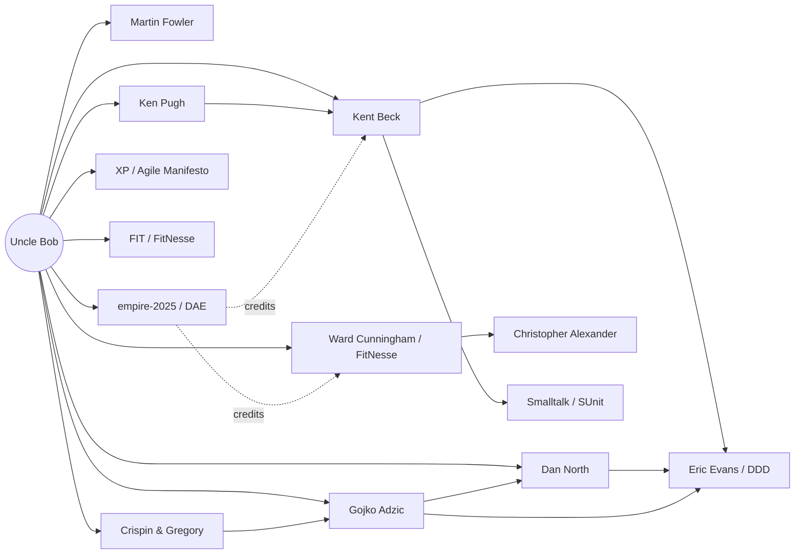

# The Trusted-Source Network

How the research was scoped, and the citation graph it produced.

## Method

Rooted at **Robert C. Martin (Uncle Bob)**, expanded two hops.

- **Hop-1** = his documented ATDD lineage and collaborators, established from biographies, the FitNesse history, and his own empire-2025 work.
- **Hop-2** = the sources *those* nodes cite, ranked by how many hop-1 lineage nodes point at each — an **intra-lineage citation count**, so the figures measure centrality *within* the tradition, not raw popularity.
- A 58-agent research run built hop-2 and gathered dated Apr–Jul 2026 developments; each development then passed 3-vote adversarial verification (15 of 16 survived; 1 killed).

A vendor-rooted version of the same method (rooted at Thoughtworks) converged on *products and benchmarks*. Rooted at Uncle Bob, the network stays **human** — it converges on people and ideas. That contrast is itself a finding.

## Hop-1 — Uncle Bob's ATDD lineage

| Root | Role |
|---|---|
| Kent Beck | Taught Uncle Bob TDD (1999); Extreme Programming |
| Ward Cunningham | FIT + FitNesse co-creator; the wiki |
| Martin Fowler | Refactoring; Thoughtworks "Exploring Gen AI" |
| Ken Pugh | Lean-Agile ATDD by Example |
| Gojko Adzic | Specification by Example |
| Dan North | Behaviour-Driven Development |
| Crispin & Gregory | Agile Testing quadrants |
| XP / Agile Manifesto | Snowbird 2001 practices |
| FIT / FitNesse | Executable-spec tooling |
| empire-2025 / DAE | Uncle Bob's agentic ATDD |

## Hop-2 — the extended lineage (by intra-lineage citations)

| Source | Lineage nodes citing |
|---|---|
| Kent Beck (TDD/XP) | 9 |
| Dan North (BDD) | 7 |
| Ward Cunningham / FIT / FitNesse | 7 |
| Eric Evans (DDD) | 5 |
| Gojko Adzic (Spec by Example) | 4 |
| XP / Agile Manifesto | 4 |
| Martin Fowler | 3 |
| Smalltalk / SUnit lineage | 3 |
| Brian Marick | 2 |
| Christopher Alexander (patterns) | 2 |
| Gang of Four / Erich Gamma | 2 |
| Mike Cohn (User Stories) | 2 |

## Network diagram

## Verification caveat

"Verified" means a development survived 3-vote adversarial checking that it **was published and datable to Apr–Jul 2026**. It does not adjudicate the contested debates in [`01-sota-atdd-agentic.md`](01-sota-atdd-agentic.md) §05 — those are live disputes, flagged as such.
