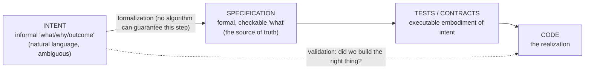

# Intent-Based vs Spec-Based Development

*Verified deep-research output (July 2026). Method: 5-angle fan-out → 23 sources fetched → 111 claims extracted → 3-vote adversarial verification (24 confirmed, 1 killed) → synthesis. Confidence is marked per claim; the headline verdict is **medium** because the term "intent-driven" is genuinely unstable in current usage.*

## Verdict

**Not a distinct competing methodology — the same underlying idea at two altitudes.** In every canonical 2026 source, **intent** is the informal *"what/why/outcome"* and the **specification** is the formal, checkable artifact that captures and operationalizes it. They are adjacent layers of one pipeline, not rival workflows:

The only *rigorous* separation is the research-grade distinction between **informal intent** and **formal specification** — not a difference in workflow.

## The evidence

### 1. In vendor usage, spec-driven IS intent-centric — the distinction collapses `[high, 3-0]`
Microsoft defines spec-driven development (SDD) as spec-first, with the spec as "connective tissue" that "links business intent to architecture, implementation, tests, and validation." GitHub's Spec Kit frames the shift as *"code is the source of truth" → "intent is the source of truth"* — and **GitHub's own docs call this "intent-driven development."** The 2026 SDD paper puts it plainly: *"The spec declares intent; the code realizes it."* All three treat intent as the *input the formal spec expresses*, not a competing method.
→ [Microsoft](https://developer.microsoft.com/blog/spec-driven-development-ai-native-engineering) · [GitHub Spec Kit](https://github.blog/ai-and-ml/generative-ai/spec-driven-development-with-ai-get-started-with-a-new-open-source-toolkit/) · [arXiv 2602.00180](https://arxiv.org/html/2602.00180v1)

### 2. The distinction that IS real: informal intent vs formal spec `[high, 3-0]`
Microsoft Research's **"intent formalization"** line (Lahiri et al., 2022–2026) is where the two are genuinely separate artifacts. It defines intent formalization as *"the translation of informal user intent into a set of checkable formal specifications,"* and names the **"intent gap"** — the semantic distance between informal NL requirements and precise program behavior — as the persistent core challenge that AI *"amplifies to an unprecedented scale."*
→ [Intent Formalization: A Grand Challenge (arXiv 2603.17150)](https://arxiv.org/abs/2603.17150) · [MSR: Trusted AI-Assisted Programming](https://www.microsoft.com/en-us/research/project/trusted-ai-assisted-programming/)

### 3. The impossibility result — why intent capture is *validation*, not *verification* `[high, 3-0]`
The sharpest finding, verbatim from MSR: *"Although the problem of checking an implementation against a specification can be defined mechanically, there is no algorithmic way of ensuring the correctness of the user-intent formalization… that a specification adheres to the user's intent — because intent is expressed informally in natural language and the specification is a formal artefact."* This is the durable reason intent and spec cannot be collapsed: spec↔code is checkable; **intent↔spec is not**.
→ [MSR: Evaluating LLM-Driven User-Intent Formalization](https://www.microsoft.com/en-us/research/publication/evaluating-llm-driven-user-intent-formalization-for-verification-aware-languages/)

### 4. Intent formalization spans a spectrum — and it lands on ATDD `[high, 3-0]`
The Grand Challenge paper frames a tradeoff spectrum *"from lightweight tests that disambiguate likely misinterpretations, through full functional specifications for formal verification, to domain-specific languages from which correct code is synthesized automatically."* MSR's **TiCoder** formalizes user intent *as tests* — *"tests as executable specifications that bridge informal NL requests and formally verified code."* That is the acceptance-test/ATDD move: the test is the formalized intent.
→ [TiCoder: Test-Driven User-Intent Formalization](https://www.microsoft.com/en-us/research/publication/interactive-code-generation-via-test-driven-user-intent-formalization/) · [nl2postcond](https://www.microsoft.com/en-us/research/publication/formalizing-natural-language-intent-into-program-specifications-via-large-language-models/)

### 5. "Intent" has a distinct historical lineage: Simonyi's Intentional Programming `[high, 3-0]`
**Charles Simonyi's Intentional Programming** (MSR-TR-95-52, Sept 1995; later Intentional Software) is a *system/representation*, not an AI-era workflow: programs are encoded as machine-manipulable **trees of "intention" nodes** that separate computational intent from implementation, enabling automatic re-generation of code as implementation knowledge changes. This is why "intent" carries a ~30-year heritage that "spec-driven" does not — evidence they are not simply the same idea renamed.
→ [Intentional Programming (MSR-TR-95-52)](https://www.microsoft.com/en-us/research/wp-content/uploads/2016/02/tr-95-52.doc) · [Edge.org: Simonyi](https://www.edge.org/conversation/charles_simonyi-intentional-programming)

## Overlap vs difference

| Axis | Spec-driven | Intent-driven |
|---|---|---|
| **Altitude** | Detailed, checkable *what* | Higher-level *why / outcome* |
| **Formality** | Formal, machine-checkable | Informal natural language (ambiguous) |
| **Core artifact** | The specification (the source of truth) | The intent behind it |
| **Hard problem** | Keep spec ↔ code in sync (*mechanically checkable*) | Close the intent gap: spec ↔ intent (*not mechanically checkable*) |
| **Guarantee type** | Verification | Validation |
| **Lineage** | Requirements eng. / ATDD / BDD | Simonyi's Intentional Programming (1995) |
| **2026 usage** | Concrete workflow/tooling (Spec Kit, Kiro) | Usually a *framing around* SDD — often literally equated with it |

## Relation to ATDD and agentic coding (ties to `01`–`04`)

This slots directly onto the ATDD research in this folder. In the intent-formalization stack, **an acceptance test is a formalized intent** — the lowest, most practical rung. So:
- **ATDD is a concrete method for closing the intent gap** — the test pins ambiguous intent into a checkable artifact (MSR's TiCoder is literally this).
- "The only properly detailed spec is a test" (doc `01`, §01) is the ATDD-flavored answer to the intent-formalization challenge.
- **Intent-driven** names the *upstream goal layer*; **spec-driven / ATDD** is *how you make that intent verifiable for an agent*. Complementary, not a choice — which is the practical stance for `analyst`.

## What we did *not* confirm

- A tempting claim — that Intentional Programming "prioritizes developer understanding over rigid formal specifications" — was **refuted** by verification (0 supporting sources). IP separates intent from implementation; it does not follow that it deprioritizes formality. Stated here so the omission is visible.
- The sharp "spec-driven is a *workflow*, intent-driven is a *programmable system* / the intent file *is* the system" contrast (from an earlier opinionated blog) did **not** survive as a canonical distinction. It is one vendor's framing, not consensus.

## Answering the four sub-questions

1. **Distinct methodology, rebrand, or super/subset?** — In current AI-coding discourse, **largely a rebrand/overlap**; conceptually, intent is the *superset problem* (informal goal) and spec-driven is the *subset mechanism* that formalizes it. Historically (Simonyi), a **genuinely distinct** lineage.
2. **Same or different?** — **Different altitude of the same pipeline**, not different pipelines.
3. **The durable distinction:** informal intent (ambiguous, validation-only) vs formal spec (checkable, verification). The intent↔spec gap is provably not mechanically closable.
4. **Best stance for `analyst`:** treat "intent-driven" as the goal-level framing and your existing **ATDD/DAE spec-and-test** as the formalization mechanism that closes the intent gap.

## Sources (verified)

**Primary:** [MSR Intent Formalization — arXiv 2603.17150](https://arxiv.org/abs/2603.17150) · [MSR Trusted AI-Assisted Programming](https://www.microsoft.com/en-us/research/project/trusted-ai-assisted-programming/) · [MSR Evaluating User-Intent Formalization](https://www.microsoft.com/en-us/research/publication/evaluating-llm-driven-user-intent-formalization-for-verification-aware-languages/) · [MSR TiCoder](https://www.microsoft.com/en-us/research/publication/interactive-code-generation-via-test-driven-user-intent-formalization/) · [MSR nl2postcond](https://www.microsoft.com/en-us/research/publication/formalizing-natural-language-intent-into-program-specifications-via-large-language-models/) · [Simonyi, Intentional Programming (MSR-TR-95-52)](https://www.microsoft.com/en-us/research/wp-content/uploads/2016/02/tr-95-52.doc) · [Microsoft SDD blog](https://developer.microsoft.com/blog/spec-driven-development-ai-native-engineering) · [GitHub Spec Kit](https://github.blog/ai-and-ml/generative-ai/spec-driven-development-with-ai-get-started-with-a-new-open-source-toolkit/) · [SDD: Code to Contract — arXiv 2602.00180](https://arxiv.org/html/2602.00180v1)

**Secondary / practitioner:** [Edge.org: Simonyi on Intentional Programming](https://www.edge.org/conversation/charles_simonyi-intentional-programming) · [Wikipedia: Intentional programming](https://en.wikipedia.org/wiki/Intentional_programming) · [Böckeler, SDD with Kiro/spec-kit/Tessl](https://martinfowler.com/articles/exploring-gen-ai/sdd-3-tools.html) · [Kiro](https://kiro.dev/) · [John Ferguson Smart: Intent-Driven Development](https://johnfergusonsmart.com/intent-driven-development/) · [intent-driven.dev](https://intent-driven.dev/) · [InfoQ: SDD](https://www.infoq.com/articles/spec-driven-development/)
