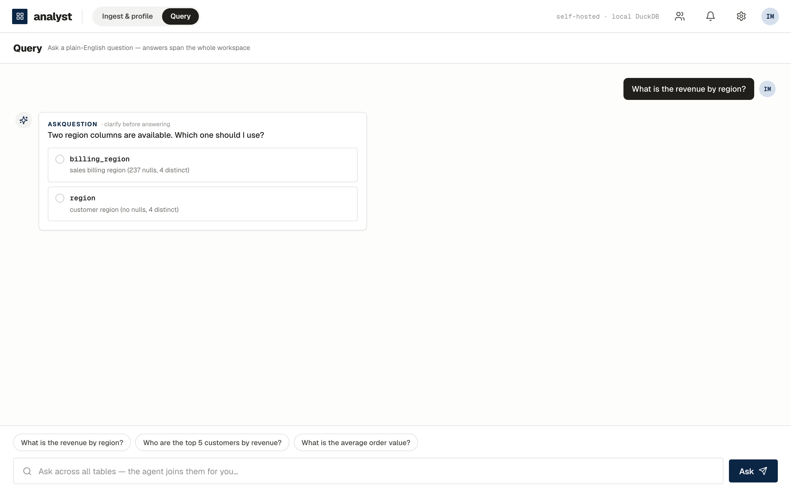
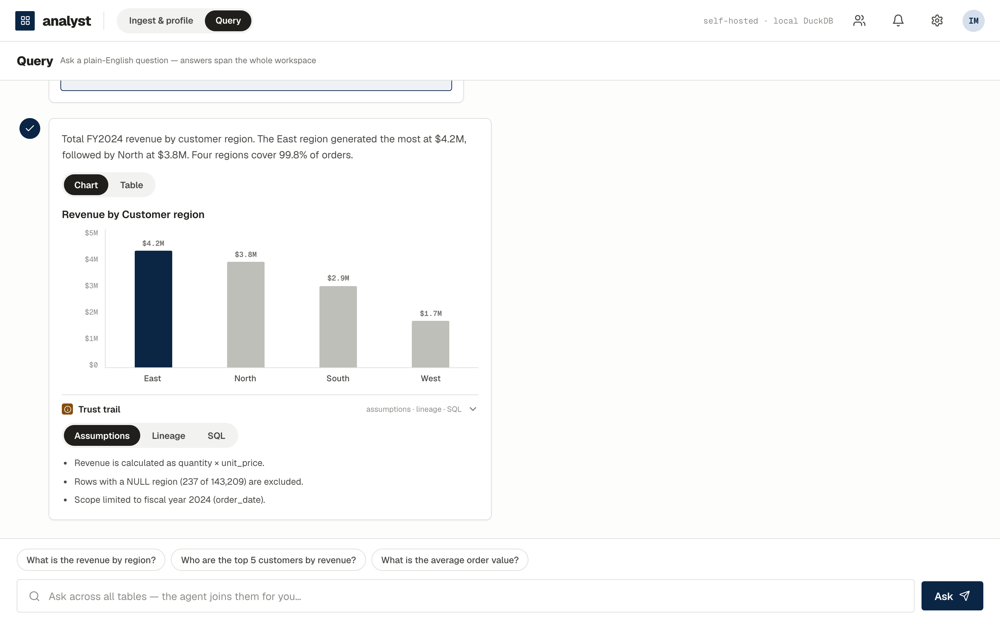
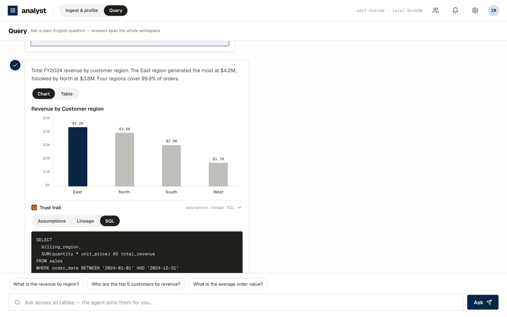
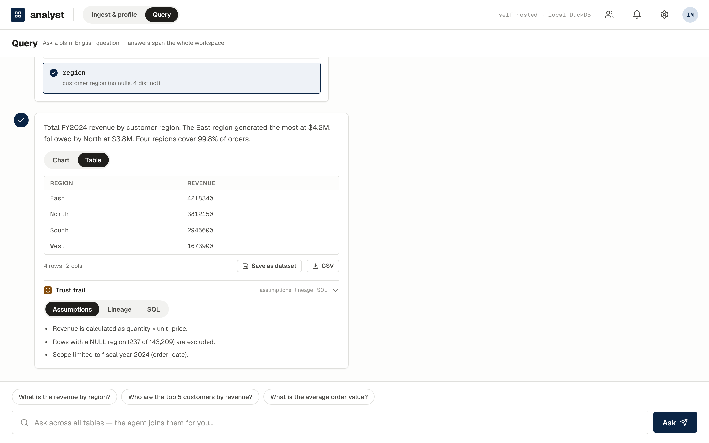

# Ask questions

[← Manual home](index.html)

Switch to **Query** and ask in plain English. Answers span the whole
workspace — the agent plans joins across your files and connected databases
using the discovered relationships.

## Clarify when it matters

The agent answers directly when it's confident. When your question is
genuinely ambiguous — say two candidate "region" columns exist — it asks
instead of guessing:

## Answers you can check

Every answer carries a chart/table toggle and a **trust trail**:

Expand the trust trail for the assumptions the agent made, the data lineage
(which tables, columns, and filters), and the exact SQL that produced the
number — the SQL executed locally in DuckDB, on your box:

If an answer can't be produced faithfully (a needed join isn't validated,
a column doesn't exist), the agent **abstains and says why** rather than
hallucinating a number.

## Do something with the result

- **Download CSV** — take the result with you.
- **Save as dataset** — the result becomes a first-class dataset in the
  catalog (profiled and catalogued like any ingest), ready for follow-up
  questions.

Next: [Administration →](admin.html)
