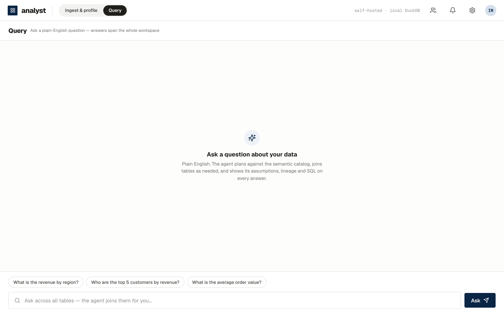

# Getting started

[← Manual home](index.html)

## Run the container

```bash
docker run -d --name analyst \
  -p 8000:8000 \
  -v analyst-data:/data \
  ghcr.io/freesidenomad/analyst:latest
```

Open **http://localhost:8000**. Everything — the API, the DuckDB/Parquet
analytical engine, and the web UI — runs in this one container. The `/data`
volume holds all workspace state (datasets, profiles, the semantic catalog);
keep it on durable storage and back it up like any database volume.

## Configuration (all optional)

| Environment variable | What it does |
|---|---|
| `ANTHROPIC_API_KEY` | Enables the LLM features: natural-language Q&A, dashboards, catalog curation, and (with `ANALYST_CATALOG=live`) agent-written catalog descriptions. Without it, ingestion/profiling/cataloguing/normalization still work — fully offline and deterministic, and the UI says so instead of degrading silently. |
| `CLAUDE_CODE_OAUTH_TOKEN` | Alternative to the API key: a long-lived Claude **subscription** token (run `claude setup-token` on a logged-in machine). Needed for containers — a host's keychain login does not reach inside. |
| `ANALYST_CATALOG=live` | Opt into live agent cataloguing (richer plain-English table/column meanings). Default is the offline, data-grounded cataloguer. |
| `ANALYST_SECRET_KEY` or `ANALYST_SECRET_KEY_FILE` | The operator key that encrypts stored database credentials so connections survive restarts. Recommended: a Docker secret mounted read-only, `ANALYST_SECRET_KEY_FILE=/run/secrets/analyst_secret_key`. **No key → credentials are session-only** (the fail-safe). |
| `ANALYST_SESSION_SECRET` | Stable signing key for login sessions (set it in any multi-user deployment). |
| `GOOGLE_CLIENT_ID/SECRET`, `MS_CLIENT_ID/SECRET` | Google / Microsoft OAuth login. The **first user to sign in becomes the admin** and can create workspaces and invite the team. |
| `ANALYST_PUBLIC_URL` | The deployment origin (pins CORS). |
| `ANALYST_DATA_DIR` | Where state lives; defaults to `/data` in the image. |

A production-ish example with credential persistence:

```bash
openssl rand -base64 32 > analyst_secret_key.txt

docker run -d --name analyst \
  -p 8000:8000 \
  -v analyst-data:/data \
  -v $(pwd)/analyst_secret_key.txt:/run/secrets/analyst_secret_key:ro \
  -e ANALYST_SECRET_KEY_FILE=/run/secrets/analyst_secret_key \
  -e ANALYST_SESSION_SECRET=$(openssl rand -hex 32) \
  -e ANTHROPIC_API_KEY=sk-ant-... \
  -e ANALYST_CATALOG=live \
  ghcr.io/freesidenomad/analyst:latest
```

Keep the key file **outside** the data volume. Losing it means stored
database connections ask for credentials again (by design — there is no
recovery path around the encryption).

## First look

The app opens on **Ingest & profile** — the semantic catalog on the left,
table detail on the right. **Query** is where you ask questions; **Charts**
holds the answers you saved (they re-run live when opened); **Dashboards**
assembles filterable, printable widget grids from a plain-English request.



Next: [Ingest & profile →](ingest.html)
