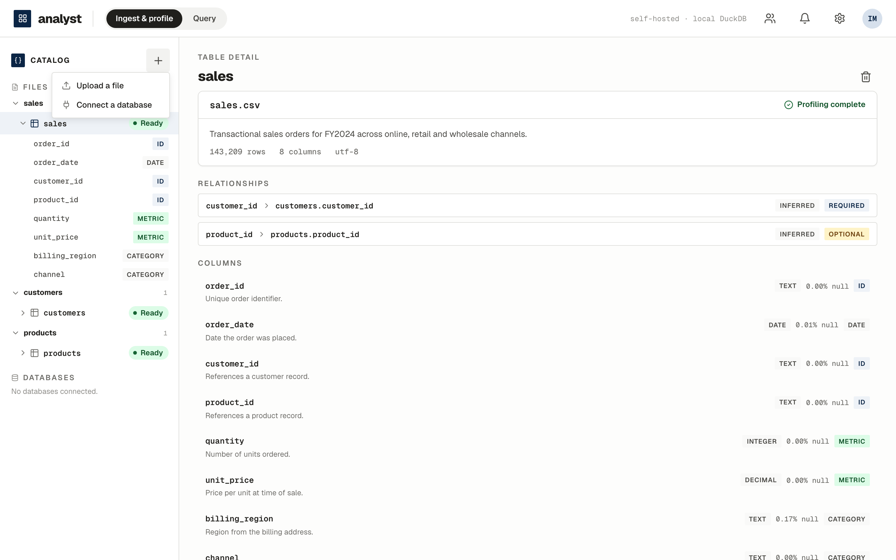
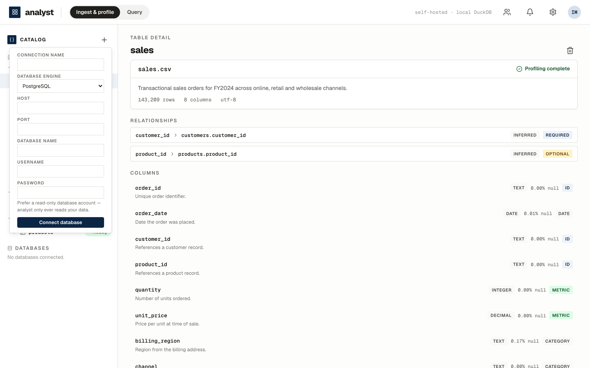

# Ingest & profile

[← Manual home](index.html)

## Add data

Click **＋ Add data** — upload a file or connect a database.

**Files:** CSV, TSV, Excel (one dataset per sheet), and JSON. Ingestion
materializes the data to Parquet/DuckDB, profiles every column (type,
nullability, cardinality, ranges, value distributions), and catalogues the
table — descriptions, column roles, and relationships — automatically.
Messy files are handled: synthesized headers, duplicate columns, mixed
types, and encodings are detected and recorded, never silently mangled.
Refreshing a dataset with new data validates it against the established
schema first.

## Normalization proposals

Real data arrives inconsistent — `East`, `east`, and `EAST` in the same
column, values with stray spaces. analyst detects these at profiling time
and shows a **Proposal** badge on the affected column. Opening the column
shows the proposed rule in plain language ("Standardize *region*: merge 3
variants into \"East\" (51 rows)") with every variant and its row count.

Nothing is ever applied silently. **Approve** and queries see the
standardized values (totals group correctly, the profile reflects the merge)
while your original file stays untouched; **Dismiss** and the proposal never
returns; **Revoke** an applied rule and the original values come straight
back. Decisions survive restarts and file refreshes. Detection is fully
local — it works identically with no AI configured.

## Curating the catalog

The catalog is agent-built but **human-curatable**. When cataloguing left an
open question ("What does the `status` column describe?"), the *Needs
review* card is a real form: pick one of the offered meanings or write your
own under *Something else*, and submit. Your answer is treated as ground
truth — the agent completes the semantic analysis, updating at most that
column's description and the table's own summary, and the question is
settled for good.

Every description also carries **Suggest a correction**: say what the data
actually means in your words and the agent folds it in the same way.
Settled meanings show a **Confirmed** badge, survive restarts and automatic
re-cataloguing (they are never silently overwritten), and immediately
sharpen natural-language answers, which plan against the catalog. Offline,
your words are applied verbatim and reconciled when AI is next available.

## The semantic catalog

Every table gets a plain-English meaning, not just a schema dump:

- **Descriptions** for the table and every column, grounded in the actual
  values ("References a customer record", "4 distinct regions").
- **Roles** — identifier, metric, category, date — drive how questions are
  answered.
- **Relationships** — primary-/foreign-key links are *discovered*, even when
  nothing is declared: candidate keys are proposed by name and type, then
  **validated against the data** (every child value must exist in the
  parent). Declared database keys, composite keys, and cross-source links
  (a CSV referencing a database table) are all first-class citizens.
- **Workspace-aware meaning** — a new table is catalogued knowing the tables
  already present, and the tables it links to are updated to mention it.

Everything the agent writes is revealable and editable — autopilot by
default, grab the wheel on demand.

## Connect a database

PostgreSQL, SQLite, SQL Server, and IBM DB2. Connections are **federated**:
nothing is copied — queries read through to the source (read-only), so use a
read-only account. Tables are profiled and catalogued like files and appear
in the same catalog; questions can join *across* files and databases.

With the operator key configured ([Getting started](getting-started.html)),
credentials are encrypted and remembered: after a restart your databases
reconnect by themselves, showing their previously derived catalog instantly.
A database that's down shows as **unreachable** with a Retry button — its
meaning stays visible, and retrying never asks for the password again.

Next: [Ask questions →](ask.html)
